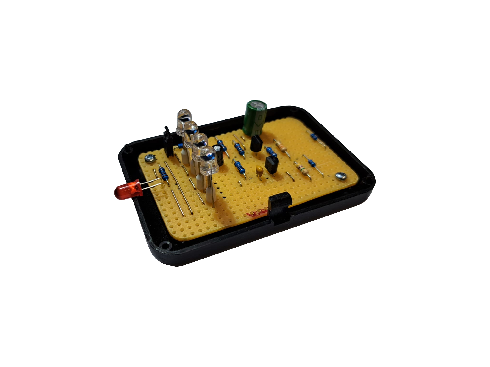

    

# Everblink Solar

The Everblink Solar is a simple electronic circuit for beginner. The circuit can be solderd on a strip grid board and needs no Battery

# Data

* [Manufacturing Data](./EBS.pdf)
* [Schematic](./Schematic.pdf)
* [Lochmaster Layout Top](./LM_Top.pdf)
* [Lochmaster Layout Bottom](./LM_Bottom.pdf)

---

R. GAECHTER